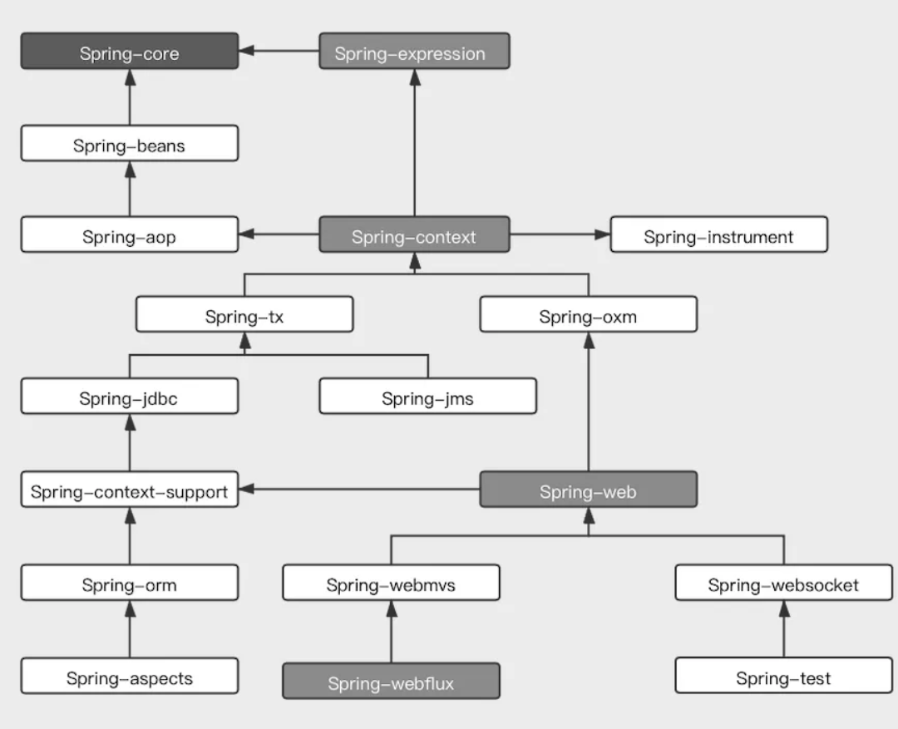

# About

## 回顾

Spring 框架除了帮我们管理对象以及依赖关系，还提供了很多其他的必要特性和功能，比较常见的几种如下：

- 通用日志记录；
- 性能统计；
- 安全控制；
- 异常处理；
- 管理数据库事务（其本身提供了一套简单的 JDBC 访问实现，同时还提供于第三方数据访问框架集成，如 Mybatis、JPA 等）；
- 能够与各种 Java EE 技术整合（如 Java Mail、任务调度等等）；
- 提供一套自己的 Web 层框架 Spring MVC，而且还能非常简单的与第三方 Web 框架集成。

Spring 到底能给我们带来什么？

#### Bean

这个 Bean 肯定是逃不掉的，从 Java 的起源说起。

- 1996 年，Java 还是新兴的变成语言。当时也是 OOP 思想飞速发展的时期。
- 同年 12 月，Sun 发布了 [JavaBean 1.00-A](https://www.oracle.com/java/technologies/javase/javabean-spec.html) 规范。这个规范规定了一套编码策略，使用简单的 Java 对象不仅可以被重用，而且还可以轻松地构建更为复杂的应用。
- 1998 年 3 月，Sun 公司发布了 EJB 1.0 规范，把 Java 组件的设计理念延伸到了服务器端，并且提供了许多必须的企业级服务。
  - 到后来 Java 组件开发理念重回正轨，新的编程技术 AOP、DI 的不断出现，为 JavaBean 提供了之前 EJB 才能拥有的强大功能，为 POJO 提供了类似 EJB 的声明式编程模型，而且没有引入 EJB 的复杂性。
  - EJB 的发展促进了基于 POJO 的编程模型，引入新的理念。EJB 3 发布时，基于 POJO 的开发框架已经成为了事实的标准。Spring 也在这样的大环境下诞生。

#### Spring 的初衷

- Spring 致力于简化 Java 开发，主要采取了 4 个策略：
  - 基于 POJO 的轻量级和最小侵入性编程；
  - 通过依赖注入和面向接口松耦合；
  - 基于切面进行声明式编程；
  - 通过切面和模板减少样板式代码；

实现上面 4 个策略主要是通过三种方式：

- 面向 Bean（BOP）；
- 依赖注入（DI）；
- 面向切面（AOP）。

分别看下这三种实现方式：

 BOP 编程 

Spring 是面向 Bean 的编程（Bean Oriented Programmin - BOP），Bean 在 Spring 中的作用就像 Object 对 OOP 的意义一样，Spring 中没有 Bean 也就没有存在的意义。Spring 提供了 IOC 容器通过配置文件或者注解的方式来管理对象之间的依赖关系。

控制反转：（面试要考的：其中最常见的实现方式叫做**依赖注入**（Dependency Injection，DI）），还有一种方式叫做「依赖查找」（Dependency Lookup - DL）。最早 Spring 是包含依赖查询的，但因为使用频率低后面被 Spring 移除了（所以在 Spring 中控制反转也被直接称为依赖注入）。

它的基本概念是：不创建对象，但是描述创建它们的方式。在代码中不直接与对象和服务连接，但在配置文件中描述哪一个组件需要哪一项服务，容器（Spring 中是 IOC 容器）复杂将这些联系在一起。典型的 IOC 场景中，容器创建了所有对象，并设置必要的属性将它们连接在一起，决定什么时间调用方法。

 依赖注入的基本概念 

Spring 核心是 [org.springframework.beans](https://docs.spring.io/spring-framework/docs/current/javadoc-api/org/springframework/beans/package-summary.html) 包（架构核心是 [org.springframework.core](https://github.com/spring-projects/spring-framework/tree/master/spring-core) 包），它的设计目标是与 JavaBean 组件一起使用。这个包通常不是由用户直接使用，而是由服务器将其用作其他多数功能底层中介。下一个最高级抽象是 BeanFactory 接口，顾名思义是工厂模式的实现，允许通过名称创建和检索对象，BeanFactory 也可以管理对象之间的关系。

BeanFactory 最底层支持两个对象模型：

- 单例：提供了巨头特定名称的全局共享实例对象，可以在查询时对其进行检索。Singleton 是默认的也是最常用的对象模型。
- 原型：确保每次检索都会创建单独的实例对象。在每个用户都需要自己的对象时，采用原型模式。

Bean 工厂的概念是 Spring 作为 IOC 容器的基础。IOC 则将处理事情的责任从应用程序代码转移到了框架。

 AOP 编程理念 

面向切面编程，即 AOP，是一种编程思想，它允许程序员对横切关注点或横切职责分界线的行为（例如日志和事务管理）进行模块化。AOP 的核心构造是切面，它将那些**影响多个类的行为封装到了可重用的模块中**。

AOP 和 IOC 是补充性的技术，都运用模块化的方式解决企业应用程序开发中的复杂问题。在典型的面向对象开发方式中，可能要将日志记录语句放在所有方法和 Java 类中才能实现日志功能。在 AOP 中可以反过来讲日志服务模块化，并以声明的方式将它们应用到需要日志的组件上。优势就是 Java 类不需要知道日志服务的存在，也不需要考虑相关的代码，所以 Spring AOP 编写的应用程序代码是松散耦合的。

AOP 功能完全集成到了 Spring 事务管理、日志和其他各种特性的上下文中，AOP 编程的常用场景有：

- Authentication（权限认证）；
- Auto Caching（自动缓存处理）；
- Error Handling（统一错误处理）；
- Debugging（调试信息输出）；
- Logging（日志记录）；
- Transactions（事务处理）等。

## Spring5 系统架构

Spring 总共大约有 20 个模块，由 1300 多个不同的文件构成。而这些组件被分别整合在：

- 核心容器（Core Container）；
- AOP（Aspect Oriented Programming）和设备支持（Instrmentation）；
- 数据访问及集成（Data Access/Integeration）；
- Web 组件；
- 报文发送（Messaging）；
- Test。

这些模块集合中。以下是 Spring 5 的模块结构图。

 核心容器 

核心容器由 spring-beans、spring-core、spring-context、spring-expression（Spring Expression Language，SpEL）4 个模块组成。

- spring-core 和 spring-beans 模块是 Spring 框架的核心模块，包含了 IOC、DI；
- BeanFactory 接口是 Spring 框架中的核心接口，它是工厂模式的具体实现
  - BeanFactory 使用控制反转对应用程序的配置和依赖性规范与实际的应用程序代码进行了分离；
  - BeanFactory 容器实例化后并不会自动实例化 Bean，只有当 Bean 被使用时 BeanFactory 容器才会对该 Bean 进行实例化与依赖关系装配。
- spring-context 模块构架于核心模块之上，它扩展了 BeanFactory，为其添加了 Bean 生命周期控制、框架事件体系以及资源加载透明化等功能。
  - 此外提供了许多企业级支持，如右键访问、任务调度等；
  - ApplicationContext 是该模块的核心接口，它的超类是 BeanFactory；
  - 与 BeanFactory 不同，ApplicationContext 容器实例化后会自动对所有的单实例 Bean 进行实例化与依赖关系的装配，使之处于待用状态。
- spring-expression 模块是统一表达式语言（EL）的扩展模块，可以查询、管理运行中的对象，同时也可以调用对象方法、操作数组、集合等。

 AOP 和设备支持 

AOP 和设备支持由由 spring-aop、spring-aspects 和 spring-instrument 3 个模块组成。

- spring-aop 是 Spring 的另一个核心模块，是 AOP 主要的实现模块。
  - 在 Spring 中，它是以 JVM 的动态代理技术为基础，然后设计出了一系列的 AOP 横切实现，比如`前置通知`、`返回通知`、`异常通知`等；
  - [Pointcut](https://github.com/spring-projects/spring-framework/blob/master/spring-aop/src/main/java/org/springframework/aop/Pointcut.java) 接口来匹配切入点，可以使用现有的切入点来设计横切面，也可以扩展相关方法根据需求进行切入。
- spring-aspects 模块集成自 AspectJ 框架，主要是为 Spring AOP 提供多种 AOP 实现方法。
- spring-instrument 模块是基于 JAVA SE 中的 java.lang.instrument 进行设计的。主要作用是在 JVM 启动时，生成一个代理类，可以通过代理类在运行时修改类的字节码，从而改变一个类的功能，实现 AOP 的功能。

 数据访问与集成 

数据访问与集成由 spring-jdbc、spring-tx、spring-orm、spring-jms、spring-oxm 5 个模块组成。

- spring-jdbc 模块是 Spring 提供的 JDBC 抽象框架的主要实现模块，用于简化 Spring JDBC 操作。
  - 主要提供 JDBC 模板方式、关系数据库对象化方式、SimpleJdbc 方式、事务管理来简化 JDBC 编程；
  - 主要实现类有 JdbcTemplate、SimpleJdbcTemplate 以及 NamedParameterJdbcTemplate。
- spring-tx 模块是 Spring JDBC 事务控制实现模块。它对事务做了很好的封装，通过它的 AOP 配置，可以灵活的配置在任何一层。

  - 事务其实是以业务逻辑为基础的，一个完整的业务应该对应业务层里的一个方法， 如果业务操作失败，则整个事务回滚；
  - 所以，事务控制是绝对应该放在业务层的，但是，持久层的设计则应该遵循一个很重要的原则：保证操作的原子性，即持久层里的每个方法都应该是不可以分割的。
  - 那么在使用 Spring JDBC 事务控制时，应该注意其**特殊性**。

- spring-orm 模块是 ORM 框架支持模块，主要集成 Hibernate, Java Persistence API (JPA) 和 Java Data Objects (JDO) 用于资源管理、数据访问对象 (DAO) 的实现和事务策略。
- spring-oxm 模块主要提供一个抽象层以支撑 OXM（OXM 是 Object-to-XML-Mapping 的缩写
  - 它是一个 O/M-mapper，将 java 对象映射成 XML 数据，或者将 XML 数据映射成 java 对象），例如：JAXB, Castor, XMLBeans, JiBX 和 XStream 等。
- spring-jms 模块（Java Messaging Service）能够发送和接收信息，自 Spring Framework 4.1 以后，它还提供了对 spring-messaging 模块的支撑。

 Web 组件 

Web 组件由 spring-web、spring-webmvc、spring-websocket 和 spring-webflux 4 个模块组成。

- spring-web 模块为 Spring 提供了最基础 Web 支持，主要建立于核心容器之上，通过 Servlet 或者 Listener 来初始化 IOC 容器，也包含一些与 Web 相关的支持。
- spring-webmvc 模块众所周知是一个的 Web-Servlet 模块，实现了 Spring MVC（model-view-Controller）的 Web 应用。
- spring-websocket 模块主要是与 Web 前端的全双工通讯的协议。
- spring-webflux 是一个新的非堵塞函数式 Reactive Web 框架，可以用来建立异步的、非阻塞、事件驱动的服务，并且扩展性非常好。

 通信报文 

spring-messaging 模块，是从 Spring4 开始新加入的一个模块，主要职责是为 Spring 框架集成一些基础的报文传送应用。

 集成测试 

spring-test 模块，主要为测试提供支持，毕竟在不需要发布（程序）到你的应用服务器或者连接到其他企业设施的情况下能够执行一些集成测试或者其他测试对于任何企业都是非常重要的。

 集成兼容 

spring-framework-bom（Bill of Materials）模块，主要解决 Spring 的不同模块依赖版本不同的问题。

各个模块之间的依赖关系：

---

Spring 版本命名规则：

| 描述方式 | 说明     | 含义                                                                 |
| -------- | -------- | -------------------------------------------------------------------- |
| Snapshot | 快照版   | 尚不稳定、处于开发中的版本                                           |
| Release  | 稳定版   | 功能相对稳定，可以对外发行但有时间限制                               |
| GA       | 正式版   | 代表广泛可以用的稳定版（General Availability）                       |
| M        | 里程碑版 | （M 是 Mileston 的意思）具有一些全新的功能或是具有里程碑意义的版本。 |
| RC       | 终测版   | Release Candidate（最终测试），即将作为正式版本发布。                |

Spring 的设计演进有很多值得我们去深入研究探讨，尤其是它解决的一些经典开发疑难问题，都值得我们切回当初那个环境视角去思考如果换做是我们自己，我们会如何做。同时，Spring 源码当中还有不少设计规范和设计模式的实践，都是我们应该学习并在日常工作编码当中实践体现的。
